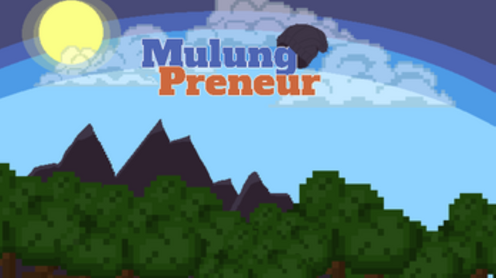
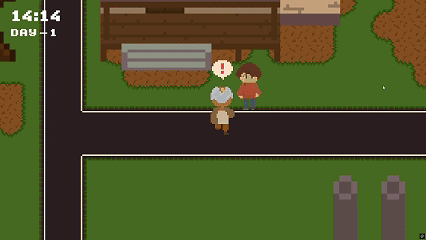
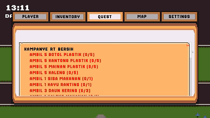
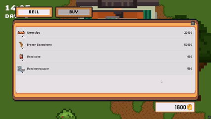

# 🌱 MulungPreneur — V2 Update  
> **Version 2.0 — Major System Revamp (October 2025)**  

### 🆕 What’s New in V2
- ⚙️ Complete project restructuring into modular folders (`V1`, `V2`)
- 💾 Brand-new save data system using ScriptableObjects  
- 🧰 Rebuilt crafting & inventory architecture (SO-based, scalable)
- 🌇 Revamped lighting & day-night system using URP  
- 🧍 Improved NPC system with new interaction logic  
- 🗺️ Enhanced dual grid map & tile management  
- 🎨 Polished UI and visuals for smoother experience  

> 💡 *This update represents a full technical revamp*

---

## 🕹️ Gameplay Showcase

<!-- GIFs showcase -->
<table width="100%">
  <tr>
    <!-- Top large gif -->
    <td colspan="2" align="center">
      
    </td>
  </tr>
  <tr>
    <!-- Bottom two gifs -->
    <td align="center" width="50%">
      
    </td>
    <td align="center" width="50%">
      
    </td>
  </tr>
</table>

---

<!-- About the game -->
<table width="100%">
  <tr>
    <!-- Left Image -->
    <td width="30%" align="center" valign="middle" style="padding:15px;">
      
    </td>
    <!-- Right Text -->
    <td width="70%" valign="top" style="padding:15px;">
      <h2>🌍 About </h2>
      

        Mulung Preneur is a serious game that raises awareness about pollution and promotes waste management. 
        Players step into the shoes of Adi, a passionate young man on a mission to reduce waste in his community. 
        By collecting, sorting, and recycling waste, Adi inspires others to take part in sustainable living and entrepreneurship.
      

      
    </td>
  </tr>
</table>

---

<h2>📜 Version 2 - Scripts</h2>
<table>
  <tr>
    <th>Script</th>
    <th>Description</th>
  </tr>

  <tr>
    <td><code>PlayerSaveManagerScript.cs</code></td>
    <td>Handles saving and loading of player data, including inventory, stats, and quest progress — ensures persistence between sessions.</td>
  </tr>

  <tr>
    <td><code>InventoryManager.cs</code></td>
    <td>Core system for managing the player's inventory — supports adding, removing, stacking, and organizing items dynamically.</td>
  </tr>

  <tr>
    <td><code>QuestManager.cs</code></td>
    <td>Controls the quest system, registering new quests, tracking objectives, and handling completion events and rewards.</td>
  </tr>

  <tr>
    <td><code>CrafterManagerV2.cs</code></td>
    <td>Manages crafting logic — validates recipes, consumes materials, and spawns crafted items using modular data-driven recipes.</td>
  </tr>

  <tr>
    <td><code>NPCDialogueManager.cs</code></td>
    <td>Implements dynamic NPC dialogue with branching text flow and event triggers, allowing interactive conversations with world characters.</td>
  </tr>
</table>

---

<pre>
MulungPreneur
└── Assets
    └── V2
        ├── Animation
        │   └── (Animation clips and controllers for V2 characters and objects)
        ├── Scene
        │   └── (Unity scenes for menus, gameplay, and environments)
        └── _Scripts
            ├── Cloud
            │   ├── CloudPrefab.cs           # Defines cloud prefab properties and behavior
            │   └── CloudSpawner.cs          # Controls procedural spawning and movement of clouds
            ├── CrafterV2
            │   ├── CrafterInteractV2.cs     # Handles player interaction with crafting stations
            │   ├── CrafterItemPrefab.cs     # Defines prefab logic for craftable items
            │   ├── CrafterManagerV2.cs      # Core crafting system logic and recipe management
            │   ├── CrafterSlotUIV2.cs       # Controls the crafting slot UI behavior
            │   ├── CrafterUIManagerV2.cs    # Manages all crafting-related UI panels
            │   ├── RecipeReq.cs             # Represents individual recipe requirements
            │   └── RecipeReqListSO.cs       # ScriptableObject storing lists of recipe requirements
            ├── Equipment
            │   ├── EquipmentScript.cs       # Handles equipment stats and functionality
            │   ├── EquipmentSO.cs           # ScriptableObject defining equipment data
            │   └── EquipmentUI.cs           # Displays equipped items and stats in UI
            ├── Interface
            │   └── IInteractable.cs          # Base interface for all interactable objects in the world
            ├── Inventory
            │   ├── InventoryManager.cs      # Core inventory system controller
            │   ├── InventorySaveData.cs     # Data structure for saving inventory state
            │   ├── InventorySlots.cs        # Defines the slot logic for holding items
            │   └── InventoryUIManager.cs    # Manages the inventory UI display and updates
            ├── Items
            │   ├── InteractableDetector.cs  # Detects nearby interactable items
            │   ├── ItemDictionary.cs        # Central reference for all items in the game
            │   ├── ItemDragHandler.cs       # Enables dragging and dropping of inventory items
            │   ├── ItemPopUpUI.cs           # Controls individual item pop-up visuals
            │   ├── ItemPopUpUIS.cs          # (Possibly a variant of ItemPopUpUI; handles batch/UI group logic)
            │   ├── ItemPrefab.cs            # Base logic for item prefab behavior
            │   ├── ItemSpawner.cs           # Spawns items dynamically in the world
            │   └── ItemsSO.cs               # ScriptableObject defining item data
            ├── Lighting
            │   ├── DayNightCycle.cs         # Controls world lighting and time-of-day transitions
            │   └── StreetLampsManager.cs    # Handles lamp activation based on time or light level
            ├── Map
            │   └── DualGridSystem           # Handles the logic for the map system, such as the dual grid system
            ├── Menu
            │   ├── AudioManager.cs          # Controls game audio playback and volume
            │   ├── MenuManager.cs           # Core manager for main menu navigation
            │   ├── MenuPauseManager.cs      # Handles in-game pause menu logic
            │   ├── MenuTabsManager.cs       # Controls switching between tabbed menu sections
            │   ├── StartMenu.cs             # Entry point for the start menu scene
            │   ├── SwitchScene.cs           # Handles scene transitions
            │   ├── VideoSetting.cs          # Manages resolution, fullscreen, and graphics settings
            │   └── VolumeSetting.cs         # Adjusts and saves player volume preferences
            ├── NPC
            │   ├── NPCDialogue.cs           # Holds dialogue data for NPCs
            │   ├── NPCDialogueManager.cs    # Controls dialogue flow and UI interactions
            │   ├── NPCScript.cs             # Base behavior script for all NPCs
            │   ├── NPCShopKeeper.cs         # Handles shopkeeper interactions and transactions
            │   ├── ShopItemPrefab.cs        # Defines shop item prefab visuals and data
            │   └── ShopUIManager.cs         # Manages shop UI and player-NPC trade interface
            ├── Player
            │   ├── PlayerCurrencyScript.cs  # Manages player money and currency updates
            │   ├── PlayerMovementScript.cs  # Controls player movement and input handling
            │   ├── PlayerSaveDataScripts.cs # Stores and loads player save data
            │   └── PlayerSaveManagerScript.cs # Oversees saving and loading of player progress
            ├── Quest
            │   ├── QuestManager.cs          # Core logic for starting, tracking, and completing quests
            │   ├── QuestSO.cs               # ScriptableObject defining quest data
            │   ├── QuestUI.cs               # Displays quest progress and objectives in UI
            │   └── RewardManager.cs         # Handles quest reward distribution

</pre>

---
---

# 🌱 MulungPreneur — V1  
<!-- GIFs showcase -->
<table width="100%">
  <tr>
    <!-- Top large gif -->
    <td colspan="2" align="center">
      
    </td>
  </tr>
  <tr>
    <!-- Bottom two gifs -->
    <td align="center" width="50%">
      
    </td>
    <td align="center" width="50%">
      
    </td>
  </tr>
</table>

--- 

<h2>📜 Version 1 - Scripts</h2>
<table>
  <tr>
    <th>Script</th>
    <th>Description</th>
  </tr>

  <tr>
    <td><code>GameManagerScript.cs</code></td>
    <td>Central hub that organizes and coordinates other managers, ensuring the game runs smoothly.</td>
  </tr>
  <tr>
    <td><code>PlayerSaveManagerScript.cs</code></td>
    <td>Handles saving and loading player progress, including stats, items, and quest data.</td>
  </tr>
  <tr>
    <td><code>InventoryManager.cs</code></td>
    <td>Controls the item system, including adding, removing, and organizing items in the inventory.</td>
  </tr>
  <tr>
    <td><code>QuestManager.cs</code></td>
    <td>Registers, tracks, and manages player quests and objectives.</td>
  </tr>
  <tr>
    <td><code>MapDualGridSystem.cs</code></td>
    <td>Manages the map’s dual grid structure for world navigation and object placement.</td>
  </tr>
</table>

---

<pre>
MulungPreneur                      # Root folder of the project
└── Assets                         # Default Unity folder for all game assets, scripts, and scenes
    ├── V1                         # Stores all assets and scripts for Version 1 of the game
    │   ├── _Animation             # Stores animation clips and controllers for V1
    │   ├── _Audio                 # Stores BGM and SFX audio clips for V1
    │   ├── _AudioMixers           # Stores audio mixer assets for volume control
    │   ├── _Fonts                 # Stores all fonts used in V1
    │   ├── _Imported              # Stores third-party assets used in V1
    │   ├── _Prefabs               # Stores pre-configured game objects for V1
    │   ├── _Quests                # Stores Scriptable Objects related to the quest system in V1
    │   ├── _Scenes                # Stores all Unity Scenes for V1
    │   ├── _Scripts               # Parent folder of all C# scripts used in V1
    │   │   ├── NPC                # Scripts related to Non-Player Character behavior (dialogue, shop, etc.)
    │   │   ├── Player             # Scripts related to player functionality (movement, data, currency)
    │   │   └── Quest              # Scripts related to the quest system (management, rewards, UI)
    │   ├── _Sprites               # Stores 2D sprites and UI elements for V1
    │   └── _Tilesets              # Stores tilesets used for creating tile-based maps in V1
</pre>

---

<h2>📋 Developers & Contributions</h2>
<table>
  <tr>
    <td align="center" width="120">
      
    </td>
    <td align="left">
      <b>Wilson H.</b> 
      Lead Programmer 
      
Implemented core systems, managers, and overall game logic, dedicating over 48 hours (6 full work days) in development.

    </td>
  </tr>
  <tr>
    <td align="center" width="120">
      
    </td>
    <td align="left">
      <b>Richter C.</b> 
      2nd Programmer & 2nd Game Artist 
      
Contributed additional programming features (such as item trading system, tilemap dual grid system, settings menu, etc.) and in-game items, and tilemaps art assets.

    </td>
  </tr>
  <tr>
    <td align="center" width="120">
      
    </td>
    <td align="left">
      <b>Kelvin</b> 
      Lead Game Artist 
      
Created the main visual assets, characters, and environments.

    </td>
  </tr>
  <tr>
    <td align="center" width="120">
      
    </td>
    <td align="left">
      <b>Jordy T.</b> 
      Lead Game Designer & Sound Designer 
      
Designed gameplay mechanics and handled sound design.

    </td>
  </tr>
  <tr>
    <td align="center" width="120">
      
    </td>
    <td align="left">
      <b>Andre J. L.</b> 
      2nd Game Designer 
      
Assisted in game balance and level design.

    </td>
  </tr>
</table>

---

<h2>🎮 Controls / Inputs</h2>

<table>
  <tr>
    <th>Action</th>
    <th>Key / Input</th>
  </tr>
  <tr>
    <td>Move Left</td>
    <td><b>A</b> / <b>←</b></td>
  </tr>
  <tr>
    <td>Move Right</td>
    <td><b>D</b> / <b>→</b></td>
  </tr>
  <tr>
    <td>Move Up</td>
    <td><b>W</b> / <b>↑</b></td>
  </tr>
  <tr>
    <td>Move Down</td>
    <td><b>S</b> / <b>↓</b></td>
  </tr>
  <tr>
    <td>Interact / Collect</td>
    <td><b>E</b></td>
  </tr>
  <tr>
    <td>Open Menu / Pause</td>
    <td><b>Tab</b></td>
  </tr>
  <tr>
    <td>Open Inventory </td>
    <td><b>Tab</b></td>
  </tr>
  <tr>
    <td>Confirm / Select</td>
    <td><b>Enter</b> / <b>Space</b></td>
  </tr>
</table>

